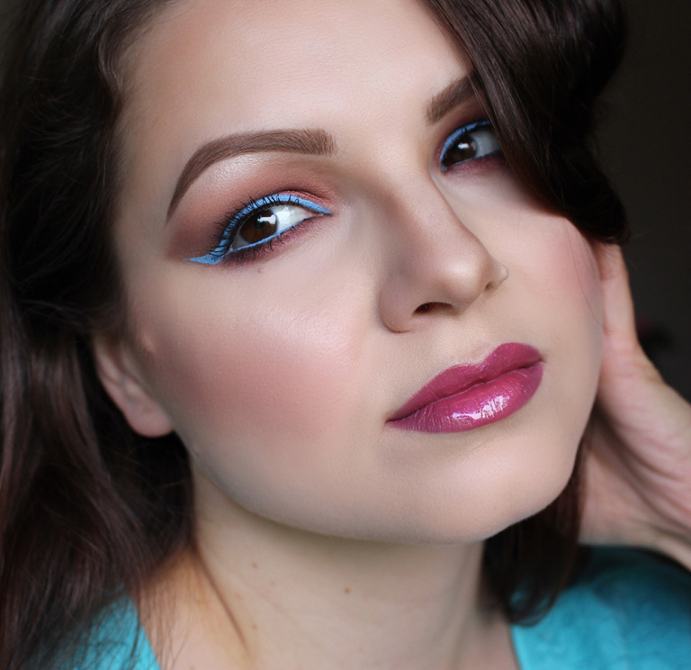
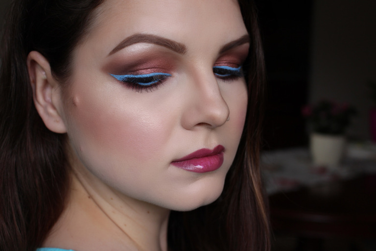
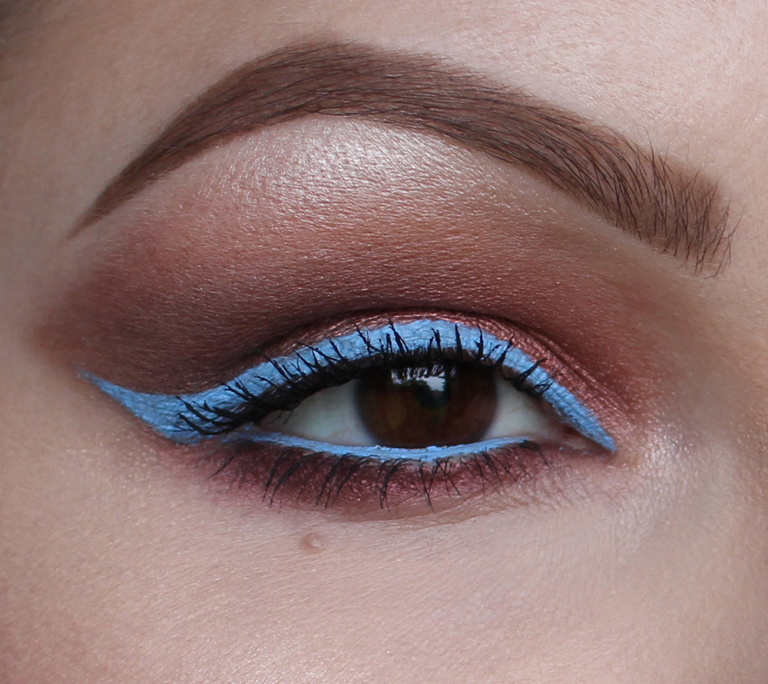

Ez a smink kicsit olyan, mint az idei nyár: borús, de azért reménykedő. Nagyon tetszenek az őszi színek a kék tussal, amivel továbbra sem tudok betelni. Jó esélyt látok rá, hogy a következő hónapokban többször fogtok még vele találkozni oldalamon. Viseljetek bátran merész színű szemceruzákat és tusokat, mert ebben a szezonban óriási trendnek számítanak.

A smink főszereplői:

Inglot gél tus 70-es árnyalata,  MAC Cosmetics Star violet szemfestéke a mozgó szemhéjamon, ajkamon pedig Mark Jacobs Kiss Kiss Bang Bang rúzsa és Sephora Queen Bee szájfénye van.

