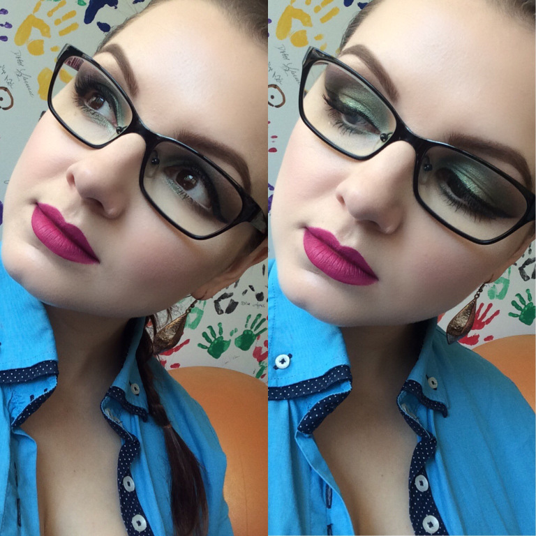
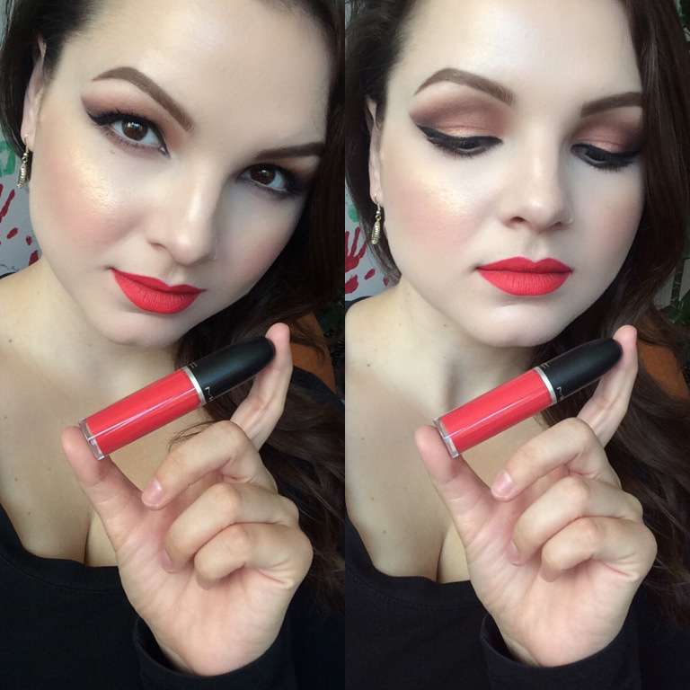
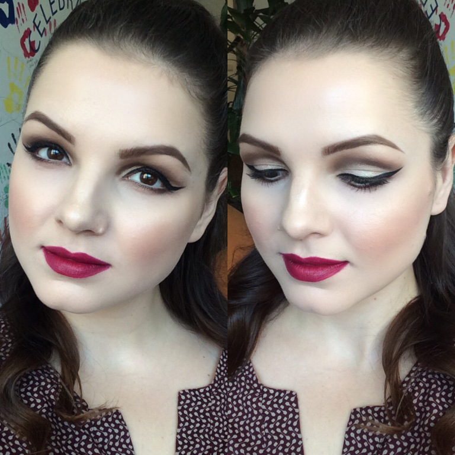

A héten hétfőtől csütörtökig minden nap készítettem egy (pár) selfie-t telefonommal, hogy megörökítsem nektek az adott nap sminkjét. Pénteken szigorúan vettem a ‘casual fridayt’ és a reggelemet az ágyban töltöttem a tükör helyett. Nem vagyok az a típus, aki smink nélkül ki sem lépne az utcára. A lenti kreációk elkészítése legalább 40-45 percembe került. Lássuk be, hogy ezt nem reális az év 365 napján tartani…

Hétfő

A kék szemfestékbe egy kis aranyat kevertem, mielőtt belegondoltam volna, hogy ettől zöldnek fog tűnni, de akkor már nem volt mit tenni. A kék inget kivasaltam és a szememet sem lett volna időm újrakezdeni. Így inkább festettem egy tusvonalat és áttértem ajkaimra, amire Dose of Colors ‘Berry me 2’ folyékony rúzsa került.

Kedd

MAC ‘Expensive pink’ szemfestékét egy kis barnával satíroztam, majd ismét tusvonalat húztam tetejére. Végre felavathattam legújabb szerzeményem is, MAC ‘Red Jade’ Retro Matte folyékony rúzsát. (Nem tudom, hogy miért hangoztatom még mindig, hogy nem vagyok egy folyékony rúzsos típus, amikor minden második alkalommal egy ilyen termékben mutatkozom…)

Szerda

A változatosság kedvéért egy úgy nevezett ‘soft cut crease-t’, azaz enyhén vágott élet festettem szememen, amit újfent egy tussal tettem igazán különlegessé. A főszerepet viszont ismét az ajkam kapta, amit Heni barátnőmtől kapott Bite Beauty ‘Beetroot’ rúzsával festettem.

Köszönöm Henim, imádom!!!

Csütörtök

Annyira különleges MAC egyik tavaly nyári kollekciójának ‘Dazzleshadow’ szemfestéke ‘Let’s Roll’ árnyalatban, hogy még a tust mellőztem csütörtökön. Persze cicás satírozással igyekeztem most is megemelni amúgy kicsit szomorú vágású szemeimet. Ajkamon MAC ‘Watch Me Simmer’ rúzsát láthatjátok.

