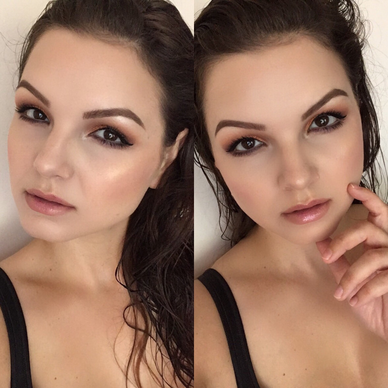
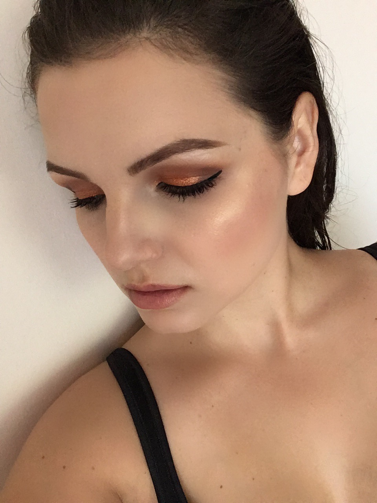

A képek minősége miatt elnézéseteket szeretném kérni, de abszolút spontán szelfiknek szántam csak őket, így a telefonommal készültek. Még a frissen mosott hajamat sem szárítottam meg…

Nagy örömömre azonban úgy tűnik, hogy tetszik nektek a végeredmény, így gondoltam megosztom (illetve kérés is volt), hogy mely termékeket használtam. Természetesen egyszerűsíthettek magatoknak, ha esetleg Ti is kipróbálnátok valami hasonlót. Valószínűleg fele ennyi termékkel is klasszul nézne ki ez a look, de mostanában keveset mozdulok ki olyan helyre, ahova sminkelnem kéne magam, így kihasználtam a lehetőséget és kiélveztem a kollekcióm nyújtotta lehetőségeket.

ARC: Make Up For Ever HD Stick alapozó (115), Urban Decay Naked Skin korrektor (Fair), MAC Mineralize Skinfinish púder (Light), Sleek Makeup pirosító (Rose Gold, 926), Anastasia Beverly Hills kontúr paletta (Fawn), Pupa highlighter (Stay Gold!, 001)

SZEM: Szemhajlat: Makeup Geek (Peach Smoothie), MAC (Soft Brown); Mozgó szemhéj: Inglot pigment (232); Satír: MAC (Sketch); Szemöldökcsont és szemzug: MAC (Nylon); Maybelline gél tus; Felső szempillák: Pupa szempillaspirál (Pupalash Energizer); Alsó szempillák: MAC szempillaspirál (Extreme Dimension – vízálló); Szem alatt: Make Up For Ever szemfesték (ME-930); Szemöldök: Anastasia Beverly Hills Dipbrow Pomade (Dark Brown)

AJAK: Flormar ajakceruza (201); Maybelline COLORsensational rúzs (107, Fairly Bare); Sephora szájfény (Queen Bee)
