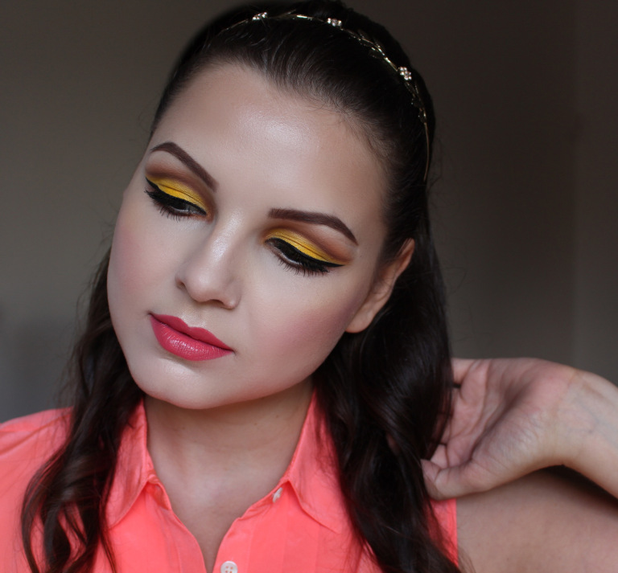

A kanári szó Édesanyám első reakciója volt a képek láttán, amit én természetesen bóknak vettem.

Azt hiszem, hogy nem túlzás állítanom, hogy ez az egyik abszolút kedvenc sminkem, amit valaha készítettem. Nem titkoltan imádok élénk színeket viselni és ezzel minden kreatív igényemet kielégítettem.

Pár hete végre sikerült a MAC-nél a korábban többször is hiába vadászott Chrome Yellow színt beszereznem. Az eladó ekkor hívta fel figyelmem a szintén élénk sárga, csak éppen fényes textúrájú Bright Sunshine nevű szemfestékre is. Mondanom sem kell, hogy mind a kettő jött velem…

Így már csak idő kérdése volt, hogy mikor próbálom ki őket, amit végül az előző hét elején Desi Perkins által YouTube-ra feltöltött videó döntött el. A legfantasztikusabb összeállítást készítette el, amit végül kicsit módosítva én is rekreáltam.

Az ő verzióját egy tusvonallal és kevés arany szemfestékkel egészítettem ki, cserében pedig lemondtam a műszempillákról. Ajkamra MAC Watch Me Simmer rúzsa, arcomon pedig új kedvencem, Sleek Makeup Rose Gold pirosítója került.

