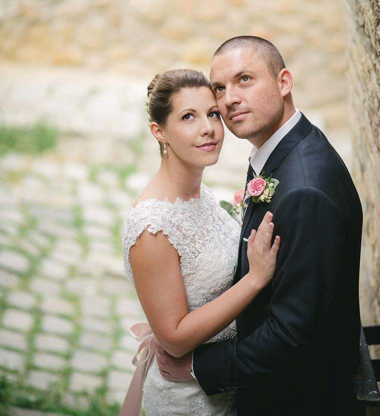
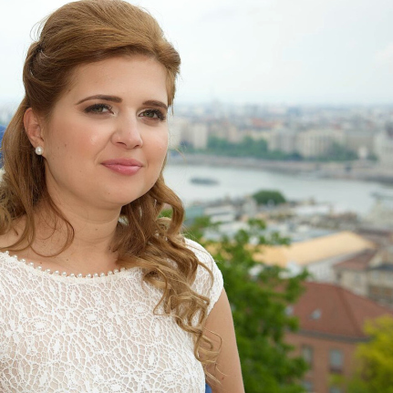

Gondoltam, hogy mielőtt elkezdek újra sminkes tartalmakat megosztani veletek elmesélem, hogy miért is voltam eltűnve az elmúlt időszakban.

A sors két teljes otthon töltött hónappal ajándékozott meg idén, aminek egy váratlan fordulat vetett véget, egy új munkahely formájában. “Vakációm” alatt nagy terveim között szerepelt a sűrűbb blogolás is, de nem kertelek, az ÉLET győzött. Pihenés, család, és olyan dolgok elintézése, melyekre már rég nem jutott idő.

Azért a szépségápolás világát sem hanyagoltam el teljesen, hiszen szerencsére sokat sminkeltem, csak elsősorban nem magamat. Köszönöm, hogy ilyen sokan megtiszteltetek a felkéréssel, hogy én készítsem el nemcsak a Ti esküvői sminkjeiteket, de a hozzátartozóitok sminkjeit is nagy napotokon. Hálás vagyok, hogy lehetőséget adtok arra, hogy azt csinálhassam, ami legközelebb áll szívemhez.

Arról se feledkezzünk meg, hogy ez idő alatt a honlapom is három éves lett. Ez nagy dolog, főleg azért, mert kevés dologgal voltam ennyire kitartó életem során, mint ezzel. Néha nehéz rendszeres tartalmat készíteni, hiszen ez mégsem a főállásom… Emiatt van is bűntudatom néha, de azért igyekszem nem túl sokat ostorozni magam, mert nem akarom, hogy a szenvedélyemből teher váljon.

Minden olvasómnak és vendégemnek szeretném megköszönni a támogatást. Külön köszönet jár azoknak, akik a fenti hadoválásomat kitartóan végigolvasták. A hét második felében pedig visszatérek a sminkek világába egy őszi trend riporttal.

