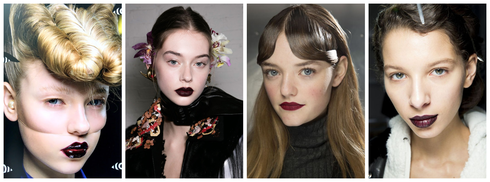
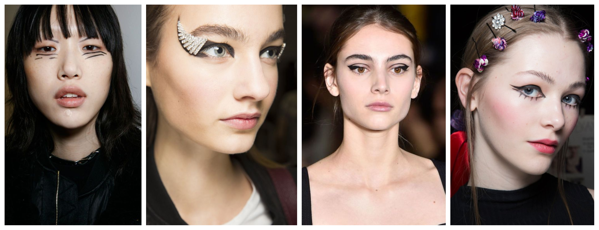
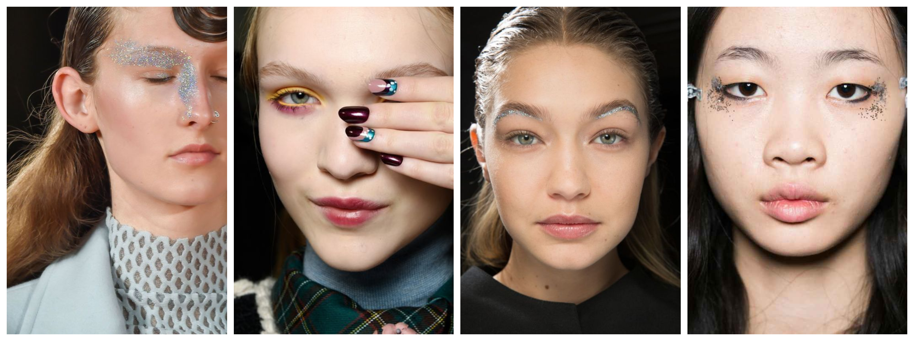
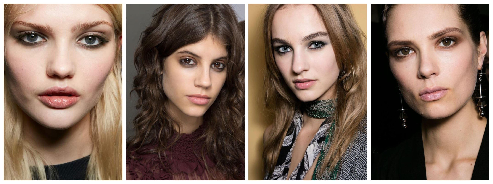
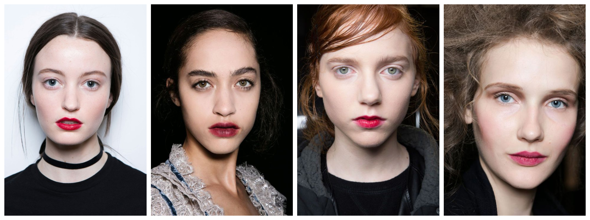

A MAC művészei ismét két kategóriára bontották az idei őszi/téli trendeket: a szigorú és a laza stílusra. Pont azt kapod ezektől a kategóriáktól, amire számítasz. A szigorú trendek drámaibbak, extrémebbek, és határozott vonalak jellemzik. A laza trendeknél pedig a természetes hatás és a színek egymásba, vagy éppen a bőrbe olvadása dominál.

Mindkét típus elérésére egyértelmű szabályok vonatkoznak, melyeket alább fejtek ki. Így mire ezt a bejegyzést végig olvasod, biztos lehetsz benne, hogy a MAC által jóváhagyott sminked lesz.

SZIGORÚ

Kemény

Nevezhetjük ‘minimalista pompának’ is ezt a trendet, ami elsősorban az ajkakra koncentrál. A rúzs textúrájától lesz igazán modern ez a smink. A szemöldökök ugyan gondosan formázottak, de a bőr egyszerű előkészítése és a szemek természetes hatása  mellett az ajkak kapják a főszerepet.

Borotva

Ez a trend olyan, mint amilyennek a neve alapján elképzeled: erős és durva. Szemléletes tusvonalakról, tiszta szemöldökökről, és egyszerű ajakakról szól.

Kaleidoszkóp

A smink diszítő ötlete átcsúszott tavaszról a hűvösebb évszakokra is. Itt másról sincs szó, mint metálos színekről, glitterről és textúrákról. Ezeket most már érettebben használjuk, de még így is friss hatást kölcsönöznek az arcnak.

LAZA

Foltos

Ez a trend majdnem azt a hatást kelti, mintha a sminkedben aludtál volna. A legfontosabb eszközök ennek eléréséhez a puhább, satírozható szemceruzák és az elmosódott ásványi szemfestékek. A végeredmény a festés nem erőltetett jellegétől lesz igazán modern.

Sugárzó

Észrevehetetlenül egymásba satírozott termékek, kopott hatású ajkak dominálják ezt a trendet. Az arc csontozatát nagyon vékony rétegű textúrákkal – legyen az krém, púder vagy fény – emelik ki. Ez a smink a csodás bőrről és a nagyszerűen “nemtörődöm” rúzsozásról szól.

