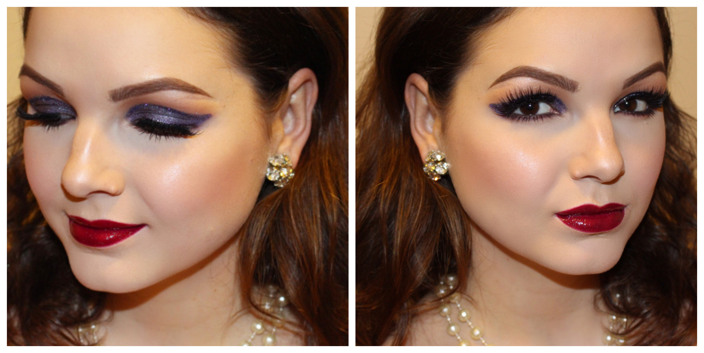
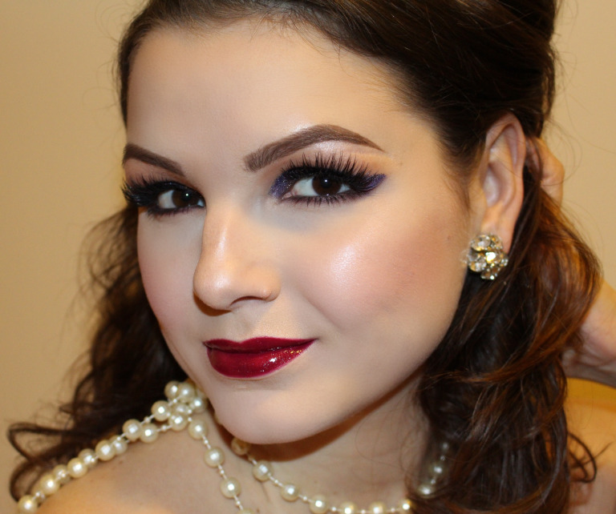

Idén kicsit hamarabb kezdődött az ünnepi láz nálam, mint általában. Igyekeztem is elfolytani, de azon kaptam magam, hogy a kezem folyamatosan glitterért és fényért nyúl. Ezért úgy döntöttem, hogy átadom magam az érzésnek, és sodródom az árral. A végeredmény ez a lila csillámos szem, és fényes bíbor ajak kombináció lett, aminek már az említésétől is melegség önti el a szívem.

Termékek

Arc: Bobbi Brown Stick Foundation (Porcelain); Urban Decay Naked Skin korrektor (Fair), Anastasia Beverly Hills (ABH) – Contour Palette (Fawn), Ben Nye púder – Neutral Set, MAC Cosmetics – Mineralize Skinfinish (Faintly Fabulous), Sleek Makeup pirosító – Rose Gold

Szem: MAC Cosmetics – Paint Pot (Painterly), MAC Cosmetics – Mineralize Skinfinish (Faintly Fabulous), Pupa – Made to Last szemfesték (010), MAC Cosmetics – Dazzleshadow szemfesték (Feel the Fever), Ben Nye glitter ragasztó – Glitter Glue, Violet Voss glitter (Victoria), ABH Dipbrow pomade (Dark brown), Bobbi Brown szempillaspirál (No Smudge), Huda Beauty műszempilla (Farah #12)

Ajak: Flormar szájceruza (nr. 206), Bite Beauty rúzs – Betroot, MAC Cosmetics szájfény – Warp Seep Ahead

Csillámos ünnepeket kívánok mindenkinek!
