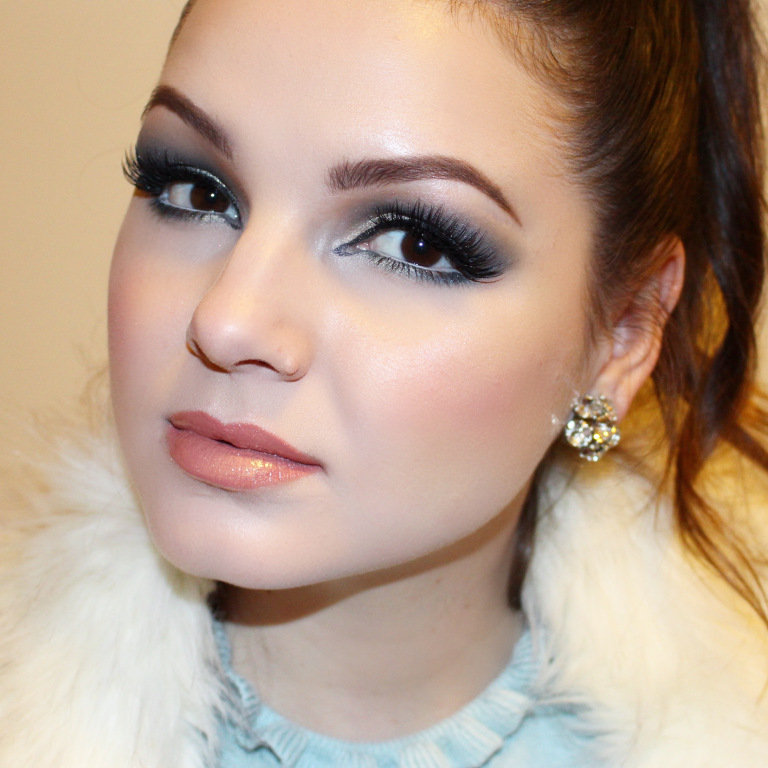
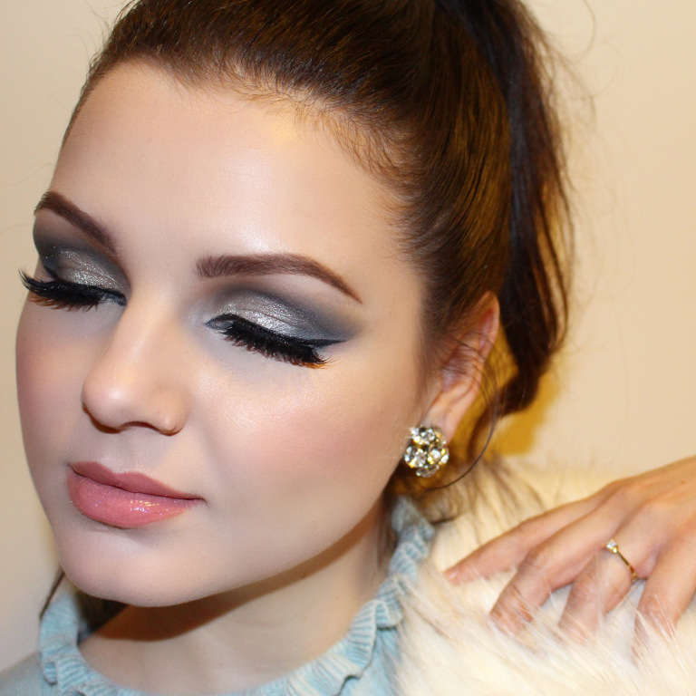

Az Oscar-díjátadó minden évben inspirál, hogy egy nagyon különleges sminket készítsek magamnak. Ez persze idén sem volt másként. Hamvaimból feltámadva ezzel az über sikkes “jégkirálynő” alkotással térek vissza a világhálóra.

Annak a tévhitnek a cáfolására is jó bizonyíték ez a smink, hogy meleg tónusúak nem viselhetnek hideg árnyalatokat. A kék és ezüst szemfestékeket ezúttal korall pirosítóval, a fenti képen barack színű rúzzsal és arany szájfénnyel, az alsó képen babarózsaszín rúzzsal és hasonló árnyalatú szájfénnyel párosítottam.

Termékek

Arc: MAC Cosmetics – Strobe krém, Make Up For Ever – Ultra HD Stick alapozó, MAC Cosmetics – Pro Longwear korrektor (NW 15), Ben Nye púder – Neutral Set, Anastasia Beverly Hills (ABH) – Contour Palette (Fawn), MAC Cosmetics – Nutcracker kollekció – Sweet Peach highlighter, MAC Cosmetics – Extra Dimension Skinfinish (Show Gold)

Szem: MAC Cosmetics – Paint Pot (Painterly), Make Up For Ever – (Vol.3) Artist Palette (ME230 , I528), Too Faced – Everything Nice Palette (Fawned of You, Shiny Happy), MAC Cosmetics – Extra Dimension Skinfinish (Show Gold), Maybelline Lasting Drama Gel tus, MAC Cosmetics szemceruza – Fascinating, ABH – Brow Definer (Medium Brown), Bobbi Brown szempillaspirál – Smokey Eye, Huda Beauty műszempilla (Farah #12)

Ajak az első képen: Flormar szájceruza (nr. 201), Bite Beauty – Crème Lip Crayons (Café), Jouer szájfény (Skinny dip)

Ajak a második képen: Flormar szájceruza (nr. 201), Gerard Cosmetics rúzs (Buttercup), Sephora szájfény (Queen Bee)

Milyen sminket szeretnétek következő alkalommal látni? Javaslataitokat a kommentekben várom.
