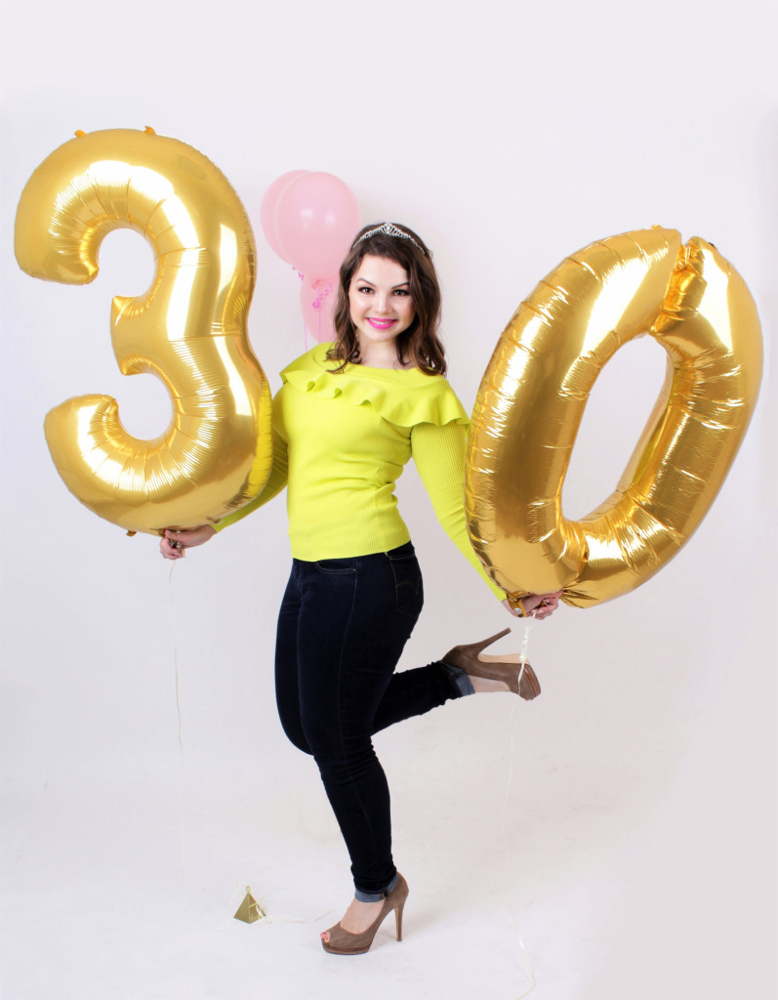
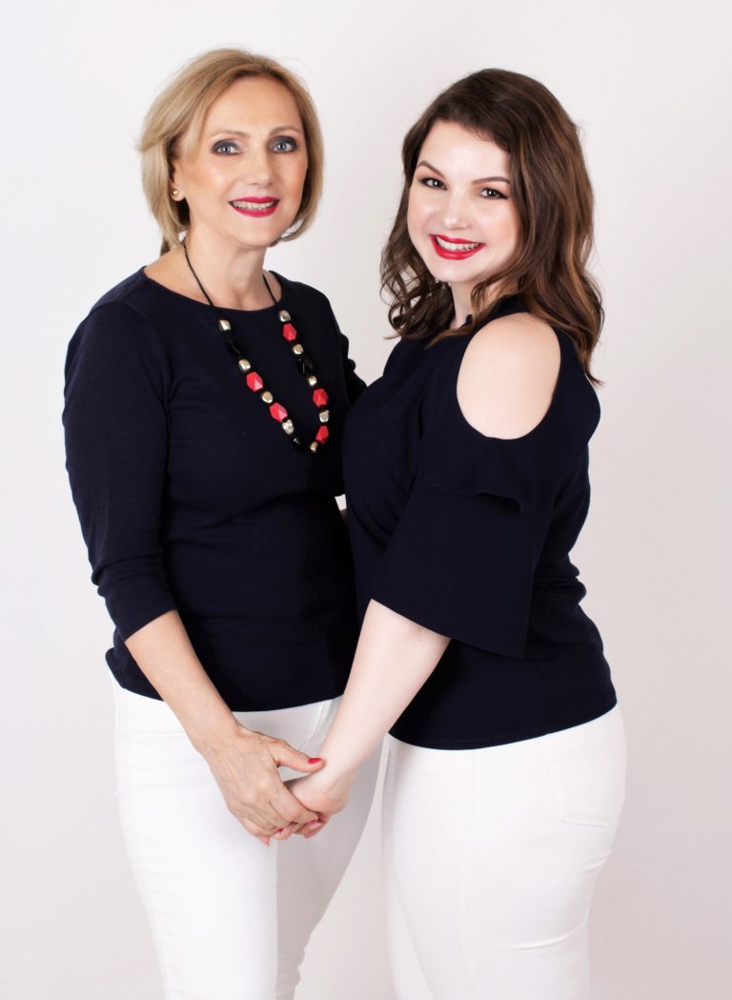
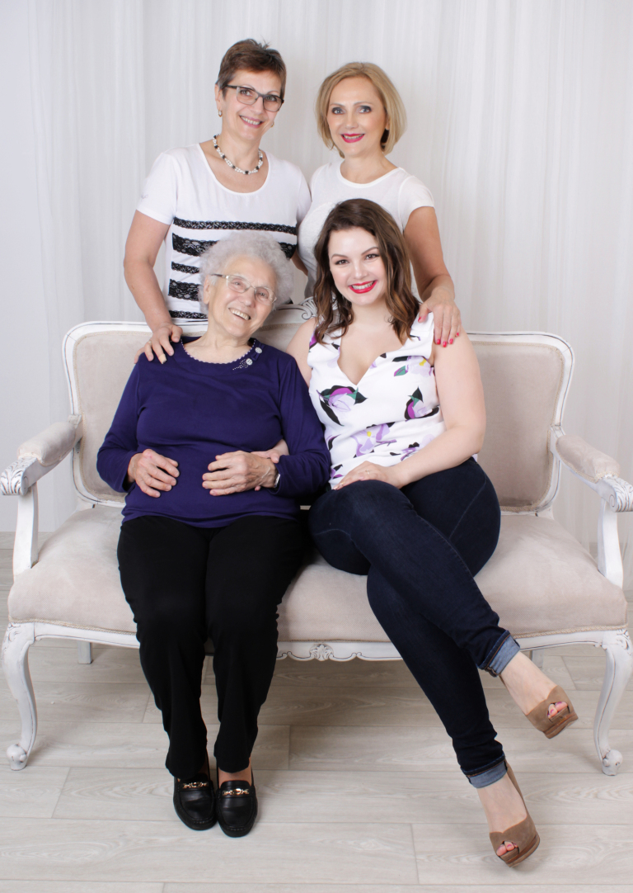
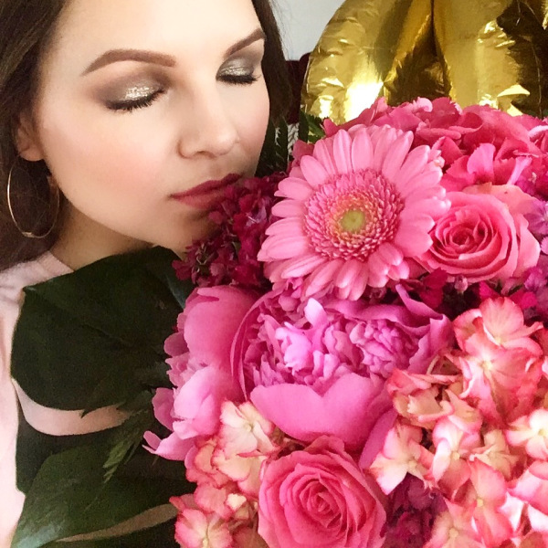
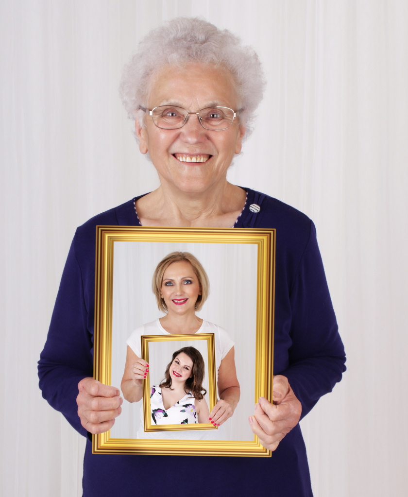

Nem túlzok, ha azt állítom, hogy a 30. születésnapomra közel fél évig készültem. Rendszeresen módosuló terveimmel próbáltam a nagy napot emlékezetessé varázsolni, aminek a programja még az utolsó pillanatokban is változott. Inspirálódásban legnagyobb segítségem ezúttal is a Pinterest volt. A szintén idén kerek szülinapos barátnőmmel, Mónival még közös szülinapi “boardunk” is volt.

Híresen, vagy ha a családomat kérdeznétek, inkább hírhedten nagy elvárásokkal indulok minden esztendőben neki eme nemes napnak. Aminek persze legtöbbször az eredménye, hogy csalódottan fekszem le. Kitartásom ezen a téren irigylésre méltó, mert lelkesedésem nem hagy alább az évek múlásával sem…

A várakozás és készülődés idén is megvolt, mint az az első mondatomból is kiderült már. Mindenáron szerettem volna elkerülni a kudarcot, amit valószínűleg a hozzám közel állók is érezékeltek, mert mindent megtettek, hogy tökéletes napom legyen. Azt azért nem állítanám, hogy nem potyogtak könnyek a bűvös dátumhoz közeledve. Szerencsére esetemben nem a szám kereksége, hanem az alkalomra kitalált szülinapi fotózáshoz történő outfit kereséshez fűződött. #firstworldproblems

Ezzel el is érkeztünk a lényeghez, egyik legfőbb kívánságomhoz, ami egy fotózás volt Édesanyámmal.

Hát nem őrülten dögös…?

Abban a kiváltságos helyzetben vagyok, hogy nem kellett a fotós személyében gondolkodnom, hiszen Évával a createvaphoto.hu megalkotójával lassan egy éve  dolgozunk együtt.

A fotózást a születésnapom előtti hétvégére szerveztük. A véletlennek köszönhetően, aznap járt nálunk vendégségben vidéken élő Nagymamám és Keresztanyám is, akik így szintén osztozhattak az élményben. Ezt szó szerint értem, hiszen Éva mellett könnyen lazulnak el még azok is, akik nincsenek a vakuk villogásához szokva.

A sminkeket természetesen magam készítettem. Az óriás lufikat pedig Dorka barátnőmtől kaptam, akinek ezúton is köszönet jár értük.

Szeretném megköszönni BFF-emnek, Heninek az óriási virágcsokrot, ami a napom legnagyobb meglepetése volt. Nem tudom leírni, hogy milyen jó érzés volt, hogy ilyen messziről is találtál rá módot, hogy jelen legyél életemben ezen a különleges napon.

Ami viszont minden ajándéknál többet ért, az a családom és barátaim kedves szavai, és az együtt töltött idő volt.

