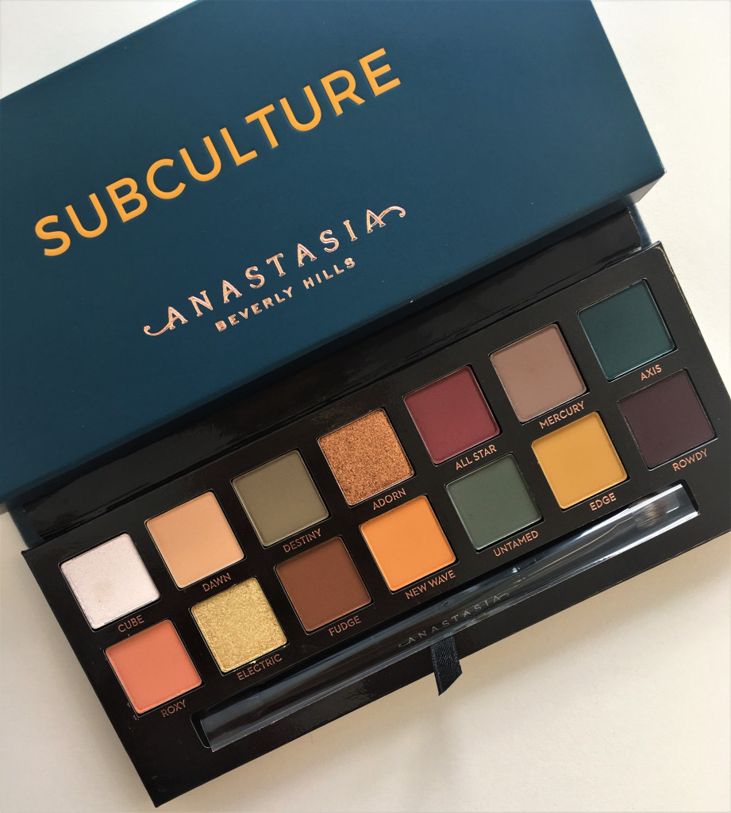
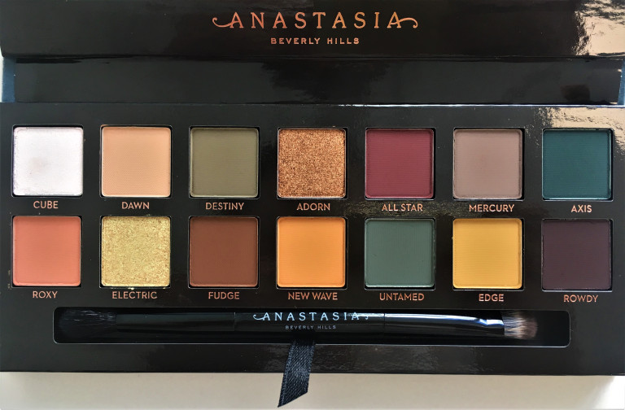
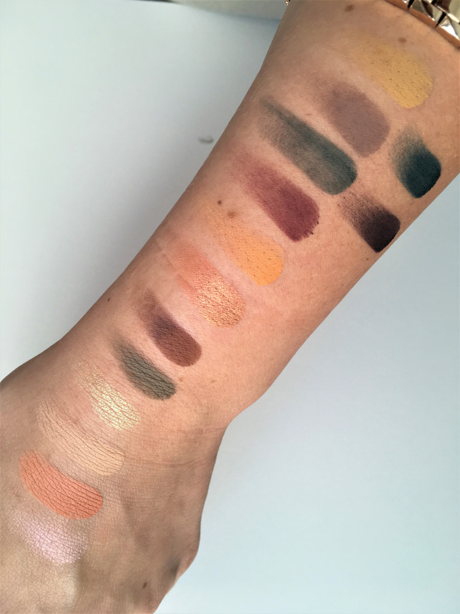

Anastasia Beverly Hills új Subculture palettája sok megpróbáltatáson ment keresztül már megjelenése előtt is, majd azt követően sem aratott osztatlan sikert az arra lecsapók körében.

A paletta képeit már tavasszal kiszivárogtatták a márka képviselőinek jóváhagyása nélkül, mely végül Amerikában július 25-én, az Egyesült Királyságban pedig augusztus 2-án debütált.

A kritikák nagy része a festék porlására, illetve foltosságára vonatkozott. Utóbbit egyáltalán nem tapasztaltam, de a porlás valóban fennáll, azonban csökkenthető megfelelő applikációval. Egyik kedvenc YouTube vloggerem, Stephanie Nicole videójában ajánlott módszere nekem is bevállt, miszerint az ecsetet elég egyszer a festékhez érinteni, nem szükséges azt forgatni benne. Így eljárva a paletta sem lett poros, és nem tapasztaltam a festék arcomra hullását sem, de elég termék került az ecsetre a színek megfelelő telítettségű felviteléhez.

A Subculture 14 színéből 11 matt, kettő duokróm (Cube, Electric), és egy metál (Adorn) hatású. Az árnyalatok jól kombinálhatóak egymással, könnyen lehet visszafogott nappali, és drámai esti sminkeket készíteni velük. A mattok véleményem szerint kiváló minőségűek, a metál Adornt nedvesen szeretem használni. A két duokróm szín viszont csalódást okozott, ezek még folyadék (MAC Fix+) segítségével is alulteljesítenek.

Én az augusztus 2-ai megjelenés napján rendeltem meg a palettát a Cult Beauty oldaláról, melyet a Magyar Posta augusztus 8-án kézbesített. A márka termékeit az oldal ebben a hónapban amúgy ingyenesen szállítja.

Tesztek a kezemen:

A fentiek ismeretében Ti megvásárolnátok a palettát?
